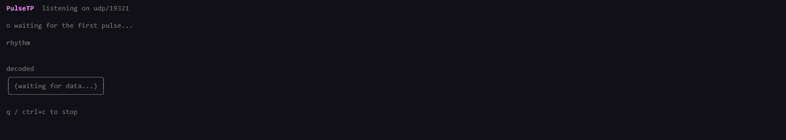
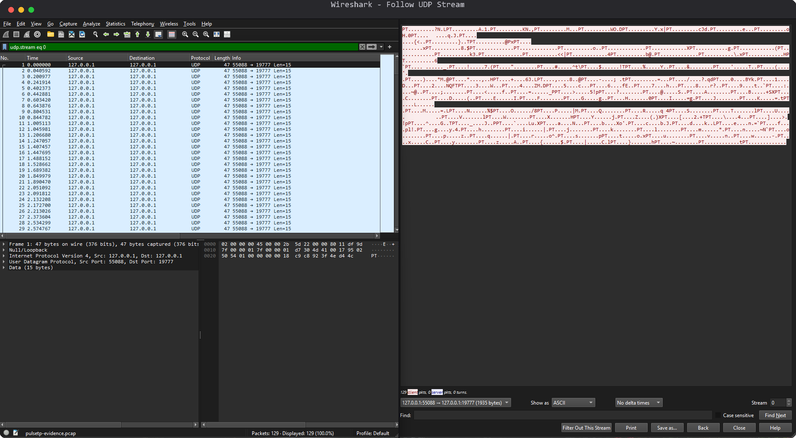

<div align="center">

  # 🕳️ PulseTP

  **Packets carry no data. The silence between them does.**

  
  
  
  

  <sub>📡 UDP · ⏱️ gap-encoded bits · 🎛️ self-calibrating · 🐹 pure Go</sub>

</div>

---

PulseTP is a rhythm-based network protocol: Morse code for sockets. A
sender fires nearly-empty UDP packets at a receiver; the packets themselves
say almost nothing. What actually carries the message is the *silence*
between one packet and the next: a short gap means one bit, a long gap
means the other. The receiver listens to the rhythm, not the payload, and
taps the message back out.

<p align="center">
  
</p>

### 🎼 What's inside

- **Rhythm is the payload**, gaps between packets encode bits, not packet
  contents. Each pulse is a 15-byte struct with a sequence number and a
  timestamp, nothing more.
- **No header, just a sync tone**: the first 8 pulses form a known,
  fixed-rhythm preamble, like a modem handshake, so the receiver can
  calibrate before real data starts.
- **Self-calibrating, not hardcoded**: the receiver measures actual
  short/long gap timing off the preamble and derives its own threshold and
  jitter tolerance, so it adapts to whatever the real network looks like.
- **Silence is the terminator**: there's no end-of-message packet. The
  sender just stops, and a long enough pause tells the receiver the
  message is complete.
- **A CLI worth watching**: `pulsetp listen` renders the incoming rhythm
  live, colored dot by dot, with the decoded message filling in as bytes
  assemble.
- **Files work too**: `--file` on `send` and `--output` on `listen` transmit
  and save raw bytes instead of text, at exactly the same (deliberately
  slow) bits-per-second as everything else.

### 🚀 Get it running

**macOS/Linux:**
```bash
git clone https://github.com/MAXIVA11/PulseTP.git
cd PulseTP
go build -o bin/pulsetp ./cmd/pulsetp
./bin/pulsetp listen --port 9000        # terminal 1
./bin/pulsetp send --to localhost:9000 --message "hello"   # terminal 2
```

**Windows (PowerShell or cmd.exe):**
```
git clone https://github.com/MAXIVA11/PulseTP.git
cd PulseTP
go build -o bin\pulsetp.exe .\cmd\pulsetp
bin\pulsetp.exe listen --port 9000
bin\pulsetp.exe send --to localhost:9000 --message "hello"
```

Watch the rhythm arrive, and the message appear.

### 🔍 Don't take our word for it

Real capture, real Wireshark: 129 packets of `"This is PulseTP"` on the
left, and what `Follow UDP Stream` sees when it tries to reassemble them
into a message on the right.

<p align="center">
  
</p>

Just noise and a repeating "PT" tag. The message was never in the packets.

### 🧠 Curious how the timing actually works?

The full wire format, calibration math, and receiver state machine, the
mini-RFC behind all of this, lives in
[`docs/PROTOCOL.md`](docs/PROTOCOL.md).

---

<div align="center"><sub>MIT License, built for messages that would rather be heard than read</sub></div>
